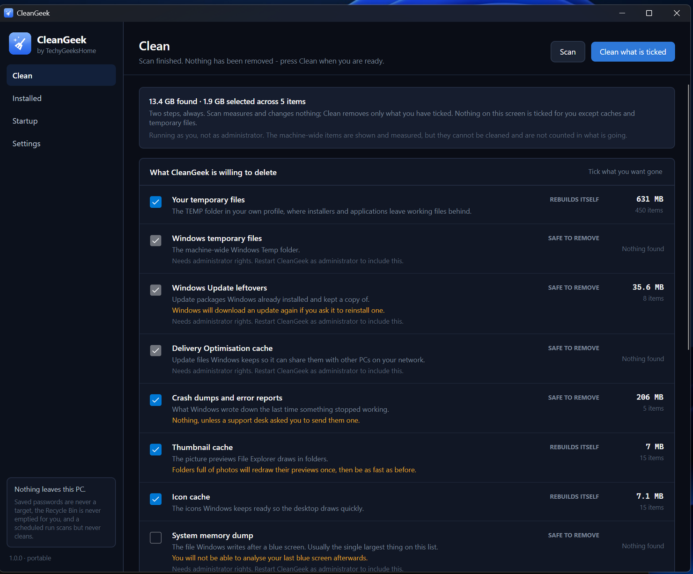
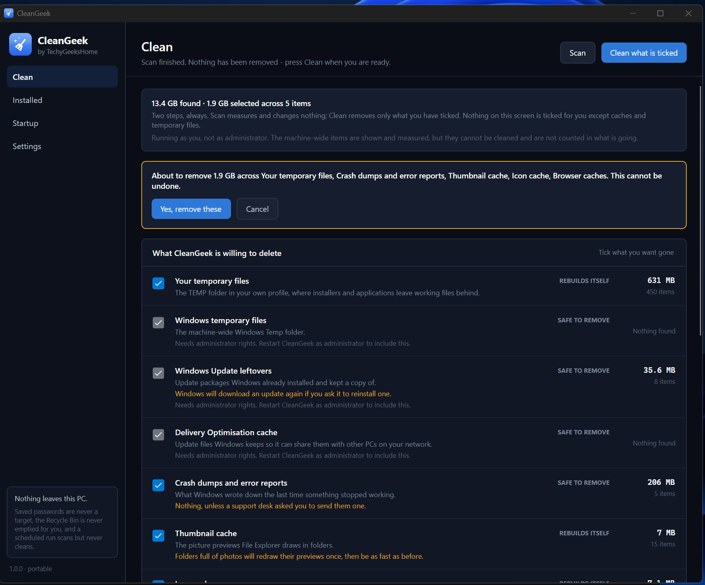
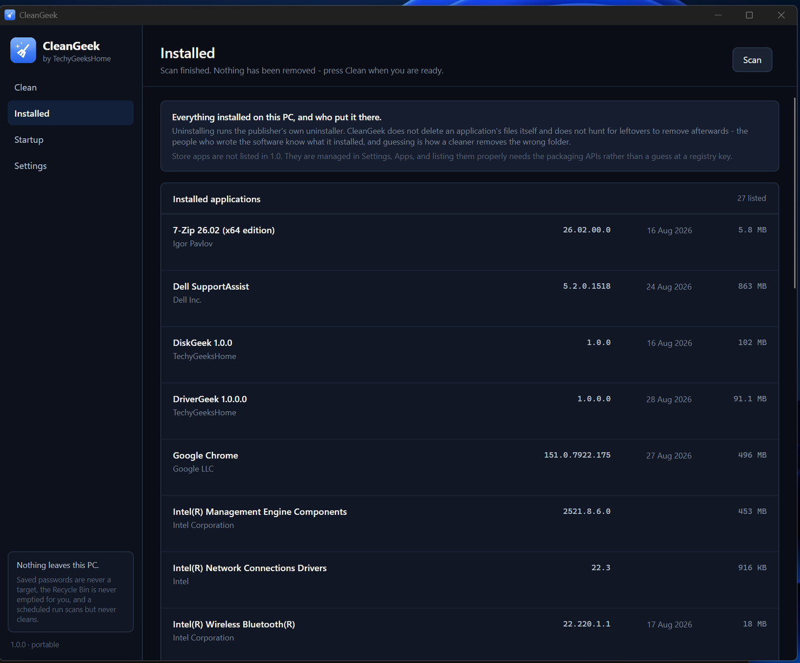
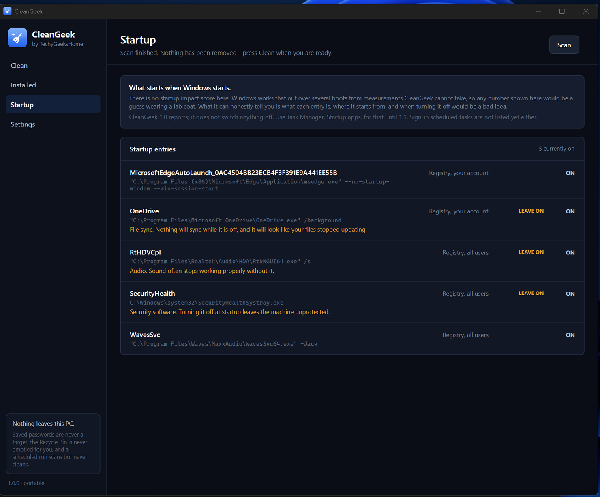
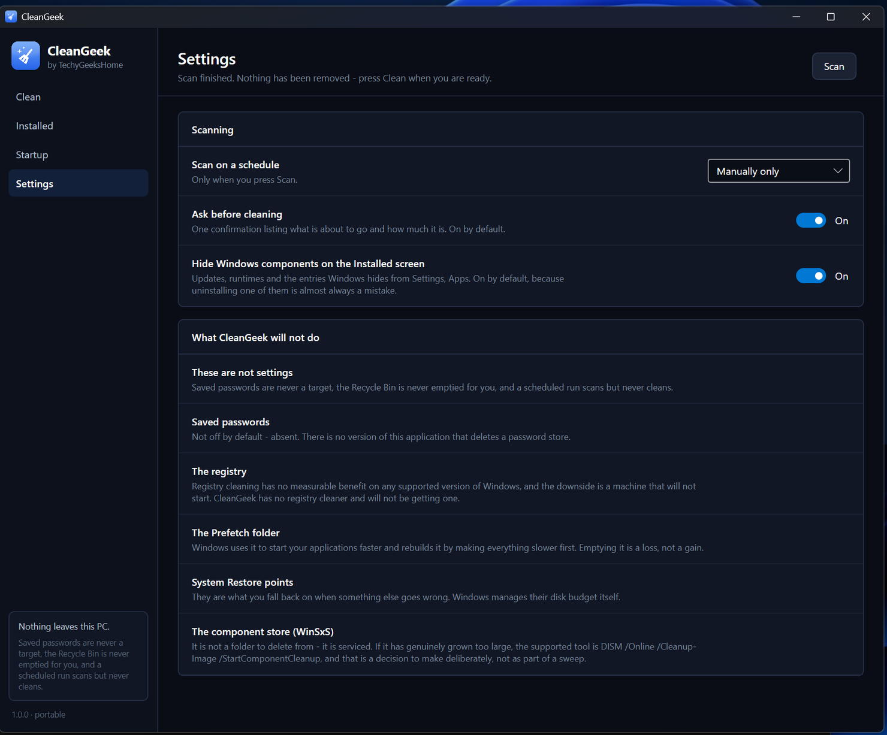

<div align="center">


# CleanGeek

**Get your disk space back. Without a registry cleaner, and without being sold to.**

[](https://github.com/techygeekshome/CleanGeek/actions/workflows/build.yml)
[](https://github.com/techygeekshome/CleanGeek)
[](#getting-it-running)
[](LICENSE)
[](https://techygeekshome.info)
[](https://ko-fi.com/techygeekshome)

[What it does](#what-it-does) · [Screenshots](#screenshots) · [What it refuses to do](#what-it-refuses-to-do) · [Getting it running](#getting-it-running) · [Build from source](#build-from-source) · [Licence](#licence)

</div>

---

There are gigabytes on a typical Windows machine that nothing needs: Windows Update leftovers,
the delivery-optimisation cache, crash dumps, thumbnail and icon caches, per-browser caches, and
the memory dump from a blue screen nobody is going to analyse. CleanGeek finds them, tells you
exactly how much each one is worth, and removes only what you tick.

The scan and the clean are always two separate steps. You see the number before anything is
deleted, and the recovered total afterwards.

## What it refuses to do

This is the other category with a deservedly poor reputation, so again, plainly:

- **There is no registry cleaner, and there will not be one.** It is the headline feature of
  every product in this space and it does not work. Nothing measurable gets faster, nothing gets
  more stable, and the failure mode is a machine that will not start. The upside is zero. We are
  not shipping it for the sake of a bullet point.
- **Saved passwords are not a cleanup target.** Not off by default — not present at all.
- **Cookies, history and saved form data are off by default**, and each one says in plain words
  what clearing it will cost you before you tick it.
- **Nothing is deleted outside a known, named list.** No wildcard sweeps of your profile.
- **The Recycle Bin is only emptied when you explicitly tick it**, never as part of "clean
  everything".
- **The component store (WinSxS) is not a folder it deletes from.** It is serviced, not swept.
  If it has genuinely grown too large the supported tool is
  `DISM /Online /Cleanup-Image /StartComponentCleanup`, and that is a decision to make
  deliberately rather than as part of a sweep.
- **The Prefetch folder is left alone.** Emptying it makes the next few starts slower, not faster.
- **No telemetry, no account, no bundled offers, no paid tier.**

## What it does

- 🧹 **Cleans what is actually safe to clean** — temporary files, Windows Update and delivery
  optimisation leftovers, crash dumps, thumbnail and icon caches, browser caches, the system
  memory dump, previous Windows installations.
- 🔢 **Shows the number first** — every item reports what it would recover before anything is
  removed, and the headline never counts something you have not ticked.
- ✅ **Nothing ticked by default except caches and temporary files.** Everything with a cost is
  opt-in, and says in plain words what that cost is.
- 📦 **Lists everything installed**, and hands an uninstall to the publisher's own uninstaller.
- 🚀 **Shows what starts with Windows**, and which entries you should leave alone.
- ⏰ **Scheduled scan** — it measures on a schedule and writes the result to the log. It never
  deletes on a schedule; there is no command line that can.
- 🔒 **Skips anything in use** — nothing is removed from under a running process.

### Where 1.0 stops

Shipping the reading half first is deliberate, and it is the same order DriverGeek took: it is
most of the value with none of the risk, and the half that changes things then lands on a
codebase people have already been running.

| | 1.0 | Coming |
|---|---|---|
| Cleaning the items on the Clean screen | ✅ | |
| Emptying the Recycle Bin, when you tick it on its own | ✅ | |
| Listing installed applications, and uninstalling one | ✅ | |
| Listing what starts with Windows | ✅ | |
| Switching a startup entry off | | 1.1 |
| Sign-in scheduled tasks in the startup list | | 1.1 |
| Store apps on the Installed screen | | 1.1 |

### What it deliberately does not duplicate

CleanGeek stays in its lane. The rest of the range already covers the neighbouring jobs:

| If you want to | Use |
|---|---|
| See what is eating your disk, visually | [DiskGeek](https://github.com/techygeekshome/DiskGeek) |
| Update your installed software | [AppGeek](https://github.com/techygeekshome/AppGeek) |
| Update your drivers | [DriverGeek](https://github.com/techygeekshome/DriverGeek) |

## Screenshots

<div align="center">

**Clean** — measures first, and removes only what you tick.



**The confirmation** — what is about to go, in words, before it goes.



**Installed** — everything installed, uninstalled through the publisher's own uninstaller.



**Startup** — what starts with Windows, and what to leave alone.



**Settings** — including a plain list of what CleanGeek will not do.



</div>

## Getting it running

CleanGeek has not had a public release yet, so there is nothing to download at the moment. When
there is, this section will carry the installer and the portable build, both with published
SHA-256 hashes.

## Build from source

Requires the [.NET 8 SDK](https://dotnet.microsoft.com/download/dotnet/8.0).

```powershell
.\build.cmd
```

That builds the solution, runs the checks, and publishes the portable build to
`publish\portable\CleanGeek.exe`. To do the steps yourself:

```powershell
dotnet build CleanGeek.sln -c Release
dotnet run --project tests\CleanGeek.Tests -c Release
```

The rules about what may be deleted live in `src/CleanGeek.Core`, which targets plain `net8.0`
and touches no Windows API, so the checks build and run anywhere — including CI, on a runner
with no files to lose. Everything that talks to Windows is in `src/CleanGeek`.

## Support & contributing

Found a bug or have a request? [Open an issue](https://github.com/techygeekshome/CleanGeek/issues)
or [get in touch](https://techygeekshome.info/contact/). Contributions are welcome — see
[CONTRIBUTING.md](CONTRIBUTING.md).

## ☕ Support

If CleanGeek gets you your weekend back, [buy us a coffee](https://ko-fi.com/techygeekshome). It
is never required and nothing is withheld without it.

## Licence

CleanGeek is free software under the **GNU General Public License v3.0** — see [LICENSE](LICENSE)
and [gnu.org](https://www.gnu.org/licenses/gpl-3.0.en.html). Anyone may use, modify and share it;
a distributed modification must publish its source under the same licence.

Free for everyone, including commercial use.

© 2026 TechyGeeksHome | Andrew Armstrong.

---

<div align="center">

Made with ❤️ by [**TechyGeeksHome**](https://techygeekshome.info)

[Website](https://techygeekshome.info) · [YouTube](https://www.youtube.com/channel/UCtEuFj1SMLiuRoucD1hv8dA) · [X](https://x.com/TechyGeeks1) · [Facebook](https://www.facebook.com/techygeeks.home) · [Instagram](https://www.instagram.com/andrewarmstrongtgh)

</div>
